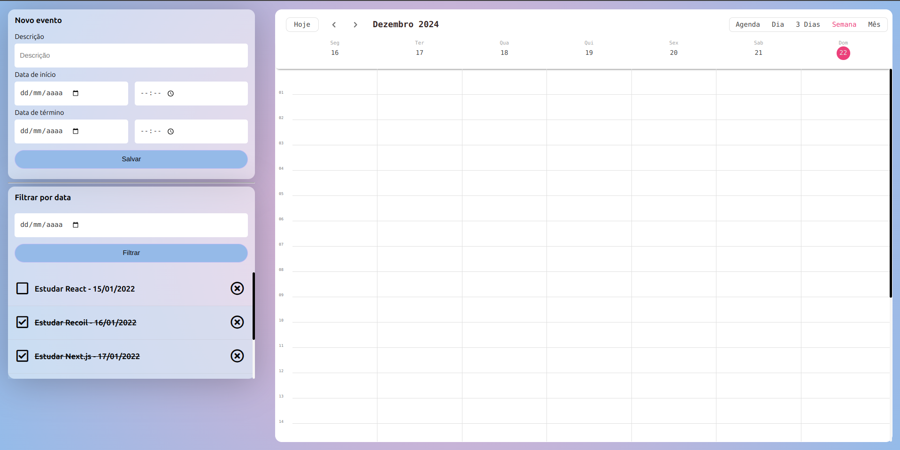

# Applicatication Information

Event Tracker is user-friendly React application designed to be a calendar for creating and managing tasks/events. It was made using React with Typescript and the json-server library. The main point of this project was learning how to manage component state with React Recoil.

## Available Scripts

In the project directory, you can run:

### `npm start`

Runs the app in the development mode.\
Open [http://localhost:3000](http://localhost:3000) to view it in the browser.

The page will reload if you make edits.\
You will also see any lint errors in the console.

## For this project, I'm using json-server to simulate a API ambient. So, you'll have to run npm start and json-server --watch db.json --port 8080 simultaneously.

### `json-server --watch db.json --port 8080`

## You can also run:

### `npm test`

Launches the test runner in the interactive watch mode.\
See the section about [running tests](https://facebook.github.io/create-react-app/docs/running-tests) for more information.

### `npm run build`

Builds the app for production to the `build` folder.\
It correctly bundles React in production mode and optimizes the build for the best performance.

The build is minified and the filenames include the hashes.\
Your app is ready to be deployed!

See the section about [deployment](https://facebook.github.io/create-react-app/docs/deployment) for more information.